<div align="center">

```
██╗  ██╗███████╗██╗     ██╗ ██████╗ ███████╗
██║  ██║██╔════╝██║     ██║██╔═══██╗██╔════╝
███████║█████╗  ██║     ██║██║   ██║███████╗
██╔══██║██╔══╝  ██║     ██║██║   ██║╚════██║
██║  ██║███████╗███████╗██║╚██████╔╝███████║
╚═╝  ╚═╝╚══════╝╚══════╝╚═╝ ╚═════╝ ╚══════╝
```

### ☀️ System 07/300: Trust Layer (L1)

[](https://solana.com)
[](https://www.anchor-lang.com/)
[](https://www.rust-lang.org/)
[](https://opensource.org/licenses/MIT)

**Decentralized Registry & Verification Protocol for Autonomous AI Agents.**

_Immutable Identity • Version Control • On-Chain Reputation_

---

[Quick Start](#-quick-start) • [Architecture](#-architecture) • [Protocol](#-protocol)

</div>

---

## 🚀 Overview

**HELIOS** is the L1 Trust Anchor for the Titan Protocol ecosystem. It enables decentralized AI Agents to prove their identity and version history cryptographically using Solana's high-performance ledger.

### 🧠 Core Capabilities

- **🔐 PDA Identity**: Agents generate deterministic addresses based on their creator's signature (`b"agent" + authority`).
- **📜 Version Ledger**: Immutable history of model versions (e.g., `v1.0` -> `v2.1`), preventing rollback attacks.
- **⚡ Status Control**: Real-time "Kill Switch" for authorized operators to deactivate compromised agents instantly.

---

## 🏗️ Architecture

```mermaid
graph TD
    subgraph EXTERNAL_WORLD ["🌍 Off-Chain Reality"]
        Dev["👨‍💻 Operator/SaaS"]
        Agent["🤖 Autonomous Agent"]
    end

    subgraph SOLANA_NETWORK ["☀️ Solana L1 Cluster"]
        RPC["🌐 RPC Gateway"]
        Runtime["⚡ Sealevel Runtime"]

        subgraph HELIOS_PROGRAM ["📜 Helios Contract (System 07)"]
            IxRegister["fn RegisterAgent()"]
            IxUpdate["fn UpdateStatus()"]
        end

        subgraph ON_CHAIN_DATA ["💾 Account Storage"]
            PDA["🔐 Agent PDA\n(Seeds: 'agent' + Authority)"]
            Account["📦 AgentEntry Account\n{ Name, Version, Active, CreatedAt }"]
        end
    end

    %% Flow Connections
    Dev -->|Sign Transaction| RPC
    Agent -->|Query Verification| RPC
    RPC -->|Instruction| Runtime
    Runtime -->|Execute| HELIOS_PROGRAM

    IxRegister -->|Derive Address| PDA
    PDA -->|Allocate & Write| Account
    IxUpdate -->|Mutate State| Account

    %% Styling
    style HELIOS_PROGRAM fill:#ff9,stroke:#333,stroke-width:2px,stroke-dasharray: 5 5
    style Account fill:#9f9,stroke:#333,stroke-width:2px
    style PDA fill:#f96,stroke:#333,stroke-width:2px
    style Dev fill:#fff,stroke:#333
    style Agent fill:#fff,stroke:#333
```



---

## 📜 Protocol Interface

### 1. Register Agent

Allocates a new on-chain identity.

- **Input**: `name: String`, `version: String`
- **Output**: PDA Address `Pubkey`
- **Cost**: ~0.0016 SOL (Rent Exempt)

### 2. Update Status

Toggles the operational state.

- **Authority**: Must sign with the Creator's Key.
- **Effect**: Updates `is_active` flag.

---

## 🔗 Titan Protocol Initiative

HELIOS serves as the foundational **Trust Layer** for the 300-System mesh.

| System     | Name        | Technology        | Role                      |
| :--------- | :---------- | :---------------- | :------------------------ |
| 01/300     | **GENESIS** | Rust / Bloom      | High-Perf Link Shortener  |
| 06/300     | **AETHER**  | Python / Voice    | L5 Real-Time Voice Stream |
| **07/300** | **HELIOS**  | **Rust / Anchor** | **L1 Agent Registry**     |
| 12/300     | **VORTEX**  | LangGraph         | Deep Research Agent       |

---

## 🛠️ Usage

### Prerequisites

- [Rust v1.75+](https://www.rust-lang.org/tools/install)
- [Solana CLI v1.18+](https://docs.solanalabs.com/cli/install)
- [Anchor v0.30+](https://www.anchor-lang.com/docs/installation)

### Quick Start

```bash
# 1. Clone the repository
git clone https://github.com/DaviBonetto/HELIOS-L1-Solana-Registry.git

# 2. Build the program
anchor build

# 3. Run validation tests
anchor test
```

---

<div align="center">

**[Titan Protocol](https://github.com/DaviBonetto)** — _Building the Nervous System of the Future._

</div>
