<div align="center">

```
██╗  ██╗███████╗██╗     ██╗ ██████╗ ███████╗
██║  ██║██╔════╝██║     ██║██╔═══██╗██╔════╝
███████║█████╗  ██║     ██║██║   ██║███████╗
██╔══██║██╔══╝  ██║     ██║██║   ██║╚════██║
██║  ██║███████╗███████╗██║╚██████╔╝███████║
╚═╝  ╚═╝╚══════╝╚══════╝╚═╝ ╚═════╝ ╚══════╝
```

### ☀️ System 07/300: Trust Layer (L1)

[](https://solana.com)
[](https://www.anchor-lang.com/)
[](https://www.rust-lang.org/)
[](https://opensource.org/licenses/MIT)

**Decentralized Registry & Verification Protocol for Autonomous AI Agents.**

---

[Quick Start](#-quick-start) • [Architecture](#-architecture) • [Protocol](#-protocol)

</div>

---

## 🚀 Overview

**HELIOS** is the L1 Trust Anchor for the Titan Protocol ecosystem. It provides an immutable, on-chain registry for AI Agents, ensuring:

- **Identity Verification**: Agents are cryptographically linked to their creators.
- **Version Control**: On-chain tracking of model versions and capabilities.
- **Status Monitoring**: Live activation/deactivation of rogue or deprecated agents.

---

## 🏗️ System Architecture

```mermaid
graph TD
    subgraph OFF_CHAIN ["🌍 Off-Chain World"]
        Dev["👨‍💻 Operator/SaaS"]
        AI["🤖 Autonomous Agent"]
    end

    subgraph SOLANA_L1 ["☀️ Solana Blockchain (L1)" ]
        RPC["🌐 RPC Node"]

        subgraph PROGRAM ["📜 Helios Program"]
            Register["fn RegisterAgent()"]
            Update["fn UpdateStatus()"]
        end

        subgraph ACCOUNTS ["💾 On-Chain Storage"]
            PDA["🔐 Agent PDA\n(Seed: 'agent' + OwnerKey)"]
            Entry["📦 AgentEntry Account\n{ Name, Version, URL, Reputation }"]
        end
    end

    Dev -- "Sign Tx (Register)" --> RPC
    AI -- "Query State" --> RPC
    RPC --> Register
    Register -- "Derive Address" --> PDA
    PDA -- "Allocate & Write" --> Entry

    style PDA fill:#f96,stroke:#333,stroke-width:2px
    style Entry fill:#9f9,stroke:#333,stroke-width:2px
    style PROGRAM fill:#ff9,stroke:#333,stroke-width:2px,stroke-dasharray: 5 5
```



---

## 📜 Protocol Interface

### 1. Register Agent

Initializes a new identity for an AI.

- **Input**: `name: String`, `version: String`
- **Output**: Creates PDA Account.

### 2. Update Status

Controls the operational flag of the agent.

- **Input**: `is_active: bool`
- **Logic**: Only the `authority` key can toggle this.

---

## 🛠️ Usage

### Prerequisites

- Rust v1.75+
- Solana CLI v1.18+
- Anchor v0.30+

### Build & Deploy

```bash
# Build the program
anchor build

# Run Verification Tests
anchor test

# Deploy to Devnet
anchor deploy --provider.cluster devnet
```

---

**Titan Protocol Initiative** — _Building the Nervous System of the Future._
